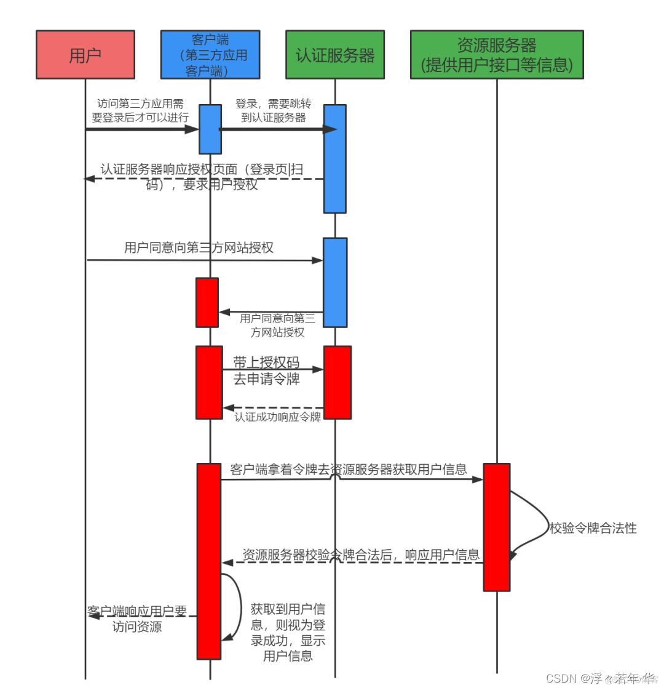
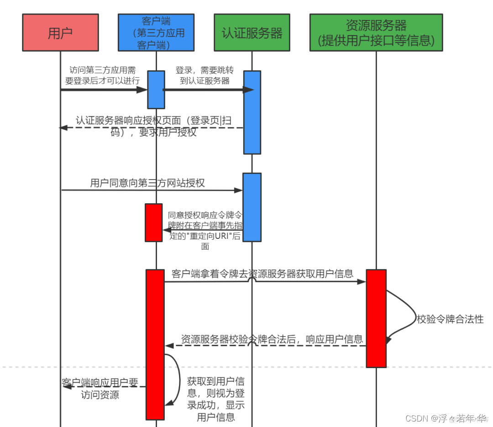
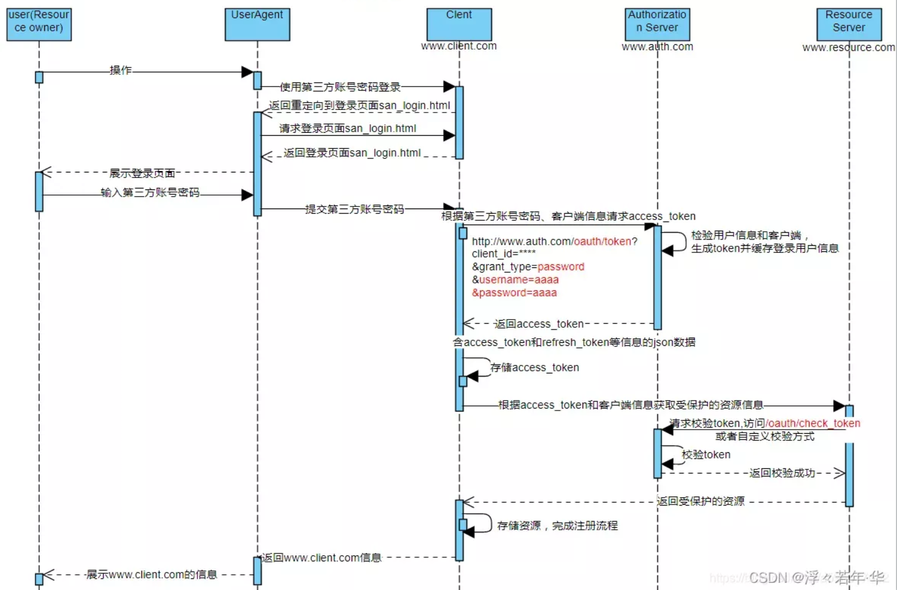
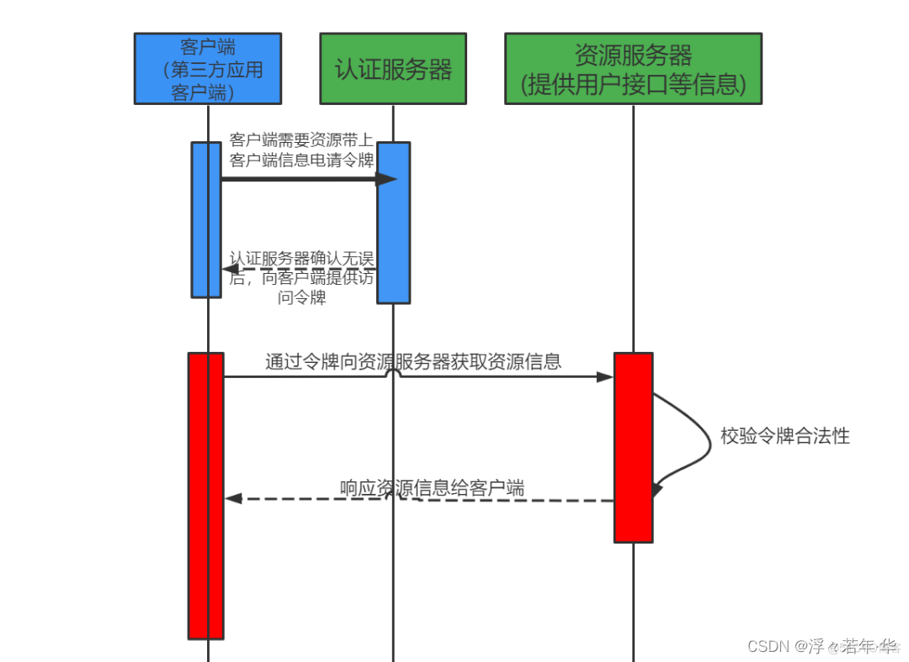

# Spring Boot 整合 spring cloud oauth2

## 1. 说明
   Oauth2.0是目前流行的授权机制，用于授权第三方应用，获取数据。
   
## 2. 授权流程（四种方式）
### 2.1 授权码模式(Authorization Code)
   正宗的oauth模式，先获取授权码，在通过授权码获取token
   
### 2.2 简化模式（Implicit）
   和授权模式相比取消了授权过程，直接获取token
   
### 2.3 密码模式（Resource Owner Password Credentials）
   客户端直接向用户获取账号密码（不安全），之后向授权服务器获取token
   
### 2.4 客户端模式（Client Credentials）
   客户端直接通过客户端认证（比如client_id和client_secret）从认证服务器获取访问令牌。
   

## 3. 配置说明
 - scopes:授权范围标识，比如指定微服务名称，则只可以访问指定的微服务
 - autoApprove:false跳转到授权页面手动点击授权，true不需要手动授权，直接响应授权码
 - redirectUris:当获取授权码后，认证服务器会重定向到指定的这个URL，并且带着一个授权码code响应。
 - withClient:允许访问此认证服务器的客户端ID
 - secret:客户端密码，加密存储
 - authorizedGrantTypes:授权类型，支持同时多种授权类型
   - authorization_code:授权模式
   - implicit:隐式授权模式(简化模式)
   - password:密码模式
   - client_credentials:客户端模式
 - refresh_token:刷新令牌模式(只有在授权模式或者密码模式才会生效)
 - accessTokenValiditySeconds :token有效时间（单位毫秒）
 - refreshTokenValiditySeconds:刷新token有效期(单位毫秒)

## 4. 服务端端点说明
   1. AuthorizationEndpoint: 授权端点
      - /oauth/authorize: 获取授权码

   2. TokenEndpoint: 令牌端点
      - /oauth/token: 获取令牌
   
   3. CheckTokenEndpoint: 解码令牌端点
      - /oauth/check_token: 用户资源服务访问的令牌解析端点
   
   4. WhitelabelApprovalEndpoint: 显示授权服务器的确认页
      - /oauth/confirm_access: 用户确认授权提交端点
   
   5. WhitelabelErrorEndpoint: 授权错误处理端点
      - /oauth/error: 授权服务错误信息端点
   
   6. TokenKeyEndpoint: JWT令牌端点
      - /oauth/token_key: 提供共有秘钥的端点，如果使用JWT令牌

